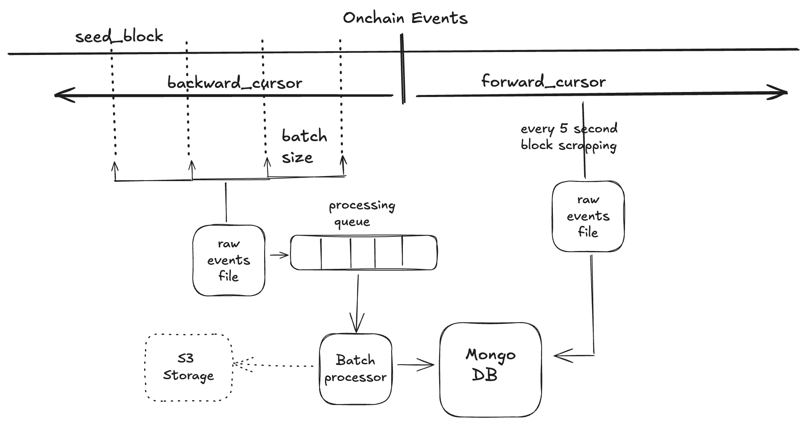

# FeesCollected Event Scraper

This project is a TypeScript-based tool designed to scrape the `FeesCollected` event from a smart contract on an EVM chain (focusing on the Polygon network for now). It efficiently retrieves new events without re-scanning previously processed blocks and stores them in a MongoDB database using Typegoose. The project also includes an optional REST API to query events by integrator and an optional Docker image for containerized deployment.

## Features

- **Event Scraping:** Automatically retrieves `FeesCollected` events from the specified blockchain starting from block `61500000`.
- **Incremental Scanning:** Efficiently scans for new events without re-scanning old blocks.
- **Data Storage:** Uses MongoDB and Typegoose for structured data persistence.
- **REST API (Optional):** Provides a simple endpoint to retrieve events for a specific integrator.
- **Dockerized Deployment (Optional):** The application is containerized for easier deployment across environments.

## Prerequisites

- **Node.js** (v20 or later recommended)
- **MongoDB** instance (local or remote)
- **Docker** and **Docker Compose**

## High Level Design



## Installation

1. **Clone the repository:**
	```bash
	git clone https://github.com/yourusername/fees-collected-scraper.git
	cd fees-collected-scraper
	```

## Running the Application Using Docker Compose
```bash
docker-compose up -d
```

## Features
- [x] Tool scrapes contract for emitted FeesCollected event on a given chain.
- [x] Tool can be started at any time to retrieve new events.
- [x] Tool works efficiently and does not scan the same blocks again.
- [x] Retrieved events are stored in a MongoDB database using Typegoose.
- [x] REST endpoint to retrieve all collected events for a given integrator.
- [x] Application wrapped into a usable Docker image.

## REST API Endpoint
If enabled, the REST API provides the following endpoint:

```
GET /api/v1/fee/<integrator-address>?page_index=0&page_size=10
```
Retrieve all FeesCollected events associated with the specified integrator.
- `page_index` starts from 0
- `page_size` specifies the number of events per page

## Future Improvements
- Compress and upload the downloaded block data into external storage like S3
- Autoswitch secondary url if primary url is exhausted with rate limit

## License
This project is licensed under the MIT License. See the [LICENSE](LICENSE) file for more details.

## References
- [Boilerplate Code Setup](https://phillcode.hashnode.dev/nodejs-console-app-with-typescript-linting-and-testing)
- [Ether JS](https://docs.ethers.org/v6/)
- [Typegoose](https://typegoose.github.io/)

